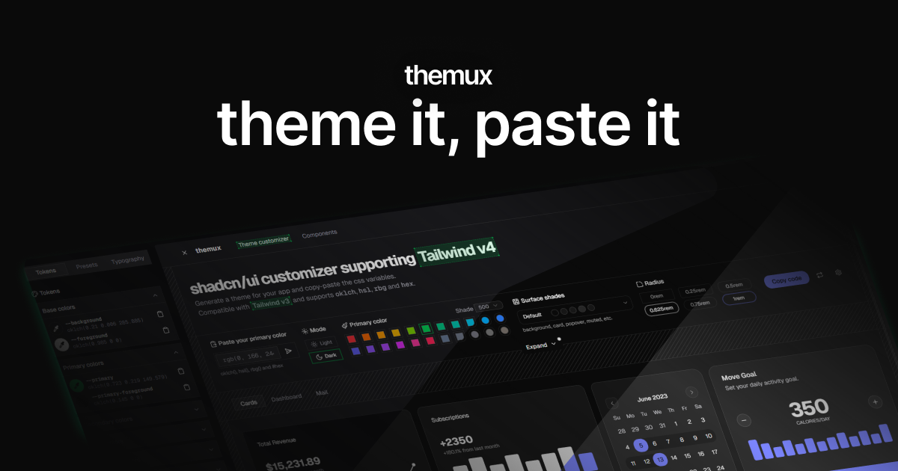

# themux

**[themux](https://themux.vercel.app)** brings great UX to theming. A (yet another) theme customizer for shadcn/ui supporting Tailwind v4. Comes with default presets to get started and offers advanced customization options for every aspect of your UI. Just begin tweaking your theme, then copy-paste the generated CSS variables into your code. _Use this to make your shadcn components stand out._

Heavily inspired by shadcn/ui and Tailwind CSS website designs.



## Features

- ✅ Compatible with Tailwind v4 and v3
- ✅ Generate your theme in OKLCH, HSL, RGB or HEX color formats
- ✅ Paste your primary color
- ✅ Token color picker
- ✅ Default shadcn/ui presets (neutral, zinc, stone, gray, slate)
- ✅ Primary and surface presets (background, card, popover, etc.)
- ✅ Components dump with the whole collection of shadcn components to see the results up-front

## Coming Features

- ⌚ More presets
- ⌚ Typography customizer and typography dump
- ⌚ Blocks showcase

## Fun Fact

The name "themux" blends "theming" and "UX" to highlight its focus on both aesthetic design and user experience.

## Run Locally

### Prerequisites

- Node.js 20+
- npm / yarn / pnpm

### Installation

1. Clone the repository:

```bash
git clone https://github.com/llanesluis/themux.git
cd themux
```

2. Install dependencies:

```bash
pnpm install
```

3. Start the dev server:

```bash
pnpm dev
```

4. Open [http://localhost:3000](http://localhost:3000) in your browser.

## License

Licensed under the MIT license.


```
      {/* {scheme && shadcnScheme ? <div>
        <h2 className="mb-4 text-xl font-bold">
          {SCHEMES.find(s => s.id === schemeType)?.name} Scheme ({isDarkMode ? "Dark" : "Light"})
        </h2>
        <div>
          <div className="grid grid-cols-1 gap-4 sm:grid-cols-2 md:grid-cols-3 lg:grid-cols-4">
            {colorRoles.map(({ name, key }) => (
              scheme[key] && (
                <ColorSwatch
                  key={name}
                  name={name}
                  color={intToHex(scheme[key])}
                />
              )
            ))}
          </div>
        </div>
      </div> : <div>Error!</div>} */}

          {/* <div className="mt-6 space-y-4">
            <div>
              <Label htmlFor="scheme-type">Scheme Type</Label>
              <Select value={schemeType} onValueChange={handleSchemeChange}>
                <SelectTrigger className="mt-1.5 w-full" disabled={isLoading}>
                  <SelectValue placeholder="Select Scheme" />
                </SelectTrigger>
                <SelectContent>
                  {SCHEMES.map((scheme) => (
                    <SelectItem key={scheme.id} value={scheme.id}>
                      {scheme.name}
                    </SelectItem>
                  ))}
                </SelectContent>
              </Select>
            </div>


            <div className="flex items-center gap-2">
              <Button
                variant={!isDarkMode ? "default" : "outline"}
                size="sm"
                onClick={() => handleDarkModeChange(false)}
                disabled={isLoading}
                className="min-w-16"
              >
                {isLoading && !isDarkMode ? "..." : "Light"}
              </Button>
              <Button
                variant={isDarkMode ? "default" : "outline"}
                size="sm"
                onClick={() => handleDarkModeChange(true)}
                disabled={isLoading}
                className="min-w-16"
              >
                {isLoading && isDarkMode ? "..." : "Dark"}
              </Button>
            </div>
          </div> */}

      {/* Theme Type Switcher */}
      {/* <div className="mb-6">
        <Tabs value={activeGenerator} onValueChange={(val) => setActiveGenerator(val as "shadcn" | "material")}>
          <TabsList className="mb-4">
            <TabsTrigger value="shadcn">Shadcn UI</TabsTrigger>
            <TabsTrigger value="material">Material Design</TabsTrigger>
          </TabsList>
        </Tabs>
      </div> */}

                {/* <Tabs value={activeTab} onValueChange={setActiveTab}>
            <TabsList className="mb-4">
              <TabsTrigger value="color">Color Picker</TabsTrigger>
              <TabsTrigger value="image">Image Upload</TabsTrigger>
            </TabsList>
            <TabsContent value="color" className="space-y-4">
              <div className="space-y-2">
                <Label htmlFor="color-picker">Select Primary Color</Label>
                <div className="flex items-center gap-4">
                  <ColorPicker
                    defaultValue={settings.source}
                    showText
                    onChangeComplete={handleColorChange}
                    allowClear={false}
                  />
                  <Button onClick={generateTheme}>Generate Theme</Button>
                </div>
              </div>
            </TabsContent>
            <TabsContent value="image" className="space-y-4">
              <div className="space-y-2">
                <Label htmlFor="image-upload">Upload Image</Label>
                <div className="flex items-center gap-4">
                  <Input
                    ref={fileInputRef}
                    id="image-upload"
                    type="file"
                    accept="image/*"
                    onChange={handleImageUpload}
                    disabled={isLoading}
                  />
                </div>
              </div>
            </TabsContent>
          </Tabs> */}

          
      {/* Shadcn Theme Display */}
      {/* {activeGenerator === "shadcn" && !isLoading && shadcnScheme && (
        <div className="mb-12">
          <div className="mb-4 flex items-center justify-between">
            <h2 className="text-xl font-bold">
              Shadcn Theme ({isDarkMode ? "Dark" : "Light"})
            </h2>
            <Button onClick={copyShadcnThemeCSS}>Copy CSS</Button>
          </div>

          {getThemePreview()}

          <div className="mt-4 grid grid-cols-1 gap-4 sm:grid-cols-2 md:grid-cols-3 lg:grid-cols-4">
            {shadcnColorRoles.map(({ name, key }) => (
              shadcnScheme[key] && (
                <ColorSwatch
                  key={name}
                  name={name}
                  color={intToHex(shadcnScheme[key] as number)}
                  displayValue={intToHslDisplay(shadcnScheme[key] as number)}
                />
              )
            ))}
          </div>
        </div>
      )} */}

      {/* Material Theme Display */}
      {/* {activeGenerator === "material" && !isLoading && !scheme && (
        <div className="rounded-lg border p-8 text-center">
          Select a color or upload an image to generate a Material theme
        </div>
      )}

      {activeGenerator === "material" && !isLoading && scheme && (
        <div>
          <h2 className="mb-4 text-xl font-bold">
            {SCHEMES.find(s => s.id === schemeType)?.name} Scheme ({isDarkMode ? "Dark" : "Light"})
          </h2>
          <div className="grid grid-cols-1 gap-4 sm:grid-cols-2 md:grid-cols-3 lg:grid-cols-4">
            {colorRoles.map(({ name, key }) => (
              scheme[key] && (
                <ColorSwatch
                  key={name}
                  name={name}
                  color={intToHex(scheme[key])}
                />
              )
            ))}
          </div>
        </div>
      )} */}


```